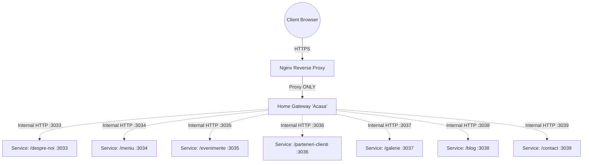

# Microservices Architecture Blueprint

This document outlines the architecture and logic for the gateway-based microservice restructure of the Ema del Mar website.

## 1. Architectural Blueprint

The architecture is designed to completely isolate individual pages into standalone Node.js environments to strictly prevent global state bleeding, CSS conflicts, and cascading memory issues (app resets). 

- **Nginx**: Exposes a single public-facing port (80/443). Forwards *all* requests exclusively to the Home Gateway.
- **Home Gateway (Acasa)**: Functions as the application layer reverse proxy, gatekeeper, and renderer for the Home page.
- **Page Services (Ports 3033-3043)**: Independent Node.js servers, each responsible for rendering exactly one route/domain of the site.

---

## 2. Request Flow Explanation

1. **Incoming Request**: A user navigates to `https://emadelmar.com/meniu`.
2. **Nginx Reception**: Nginx receives the request on port 443 and blindly forwards it to the Home Gateway process on localhost.
3. **Gateway Middleware (Rate Limiting & Security)**: The Gateway validates the request, applies IP rate limiting, and attaches global security headers (`Helmet`).
4. **Gatekeeper Evaluation**: The Gateway checks current server time against the business hours logic. 
   - *If Closed* (and route is not `/contact`), the Gateway responds immediately with the "Closed" page. It does *not* contact the downstream microservice.
   - *If Open*, the Gateway determines the correct internal port for `/meniu` (Port 3034).
5. **Internal Proxying**: The Gateway acts as an HTTP client, making an internal request to `http://localhost:3034/meniu`, attaching an `x-internal-auth` header.
6. **Service Execution**: The independent Node process on Port 3034 receives the request, validates the internal header, renders the HTML (or processes the API request), and responds.
7. **Response to Client**: The Gateway streams the microservice's response back through Nginx to the Client.

---

## 3. Communication Rules Between Services

- **Synchronous HTTP Only**: Inter-service communication happens via RESTful HTTP calls over localhost.
- **Strict Network Perimeter**: Page services must bind to `127.0.0.1` (localhost) exclusively, ensuring they can physically never be accessed directly from the external web.
- **Internal Authentication**: Every request from the Gateway to a microservice must contain a shared pre-shared key (PSK) within an HTTP header (e.g., `x-internal-auth: <SECRET_KEY>`). If a microservice receives a request without this header, it strictly returns `403 Forbidden`.
- **No Shared State**: Microservices cannot share RAM, global variables, or Redis sessions unless strictly necessary. Data that must be shared (like Menu Content logic) should be imported as a stateless utility module during the build process, not shared in runtime.

---

## 4. Failure Handling Strategy

The advantage of this microservice architecture is fine-grained failure domains.

- **Service Degradation**: If the `/galerie` service crashes due to an Out-Of-Memory error, it only affects port 3037. The Gateway detects a connection timeout or `502 Bad Gateway` from port 3037.
- **Graceful Fallback**: Instead of throwing an error to the user, the Gateway is configured with interceptors. If a microservice fails to respond, the Gateway returns a branded, localized `503 Service Unavailable` page ("This section is temporarily undergoing maintenance"), while the rest of the site (like `/meniu` or `/contact`) continues to function flawlessly.
- **Health Checks**: The Gateway polls a `/health` endpoint on each microservice every 10 seconds. If a service fails 3 consecutive checks, it is marked as "Down" (circuit breaker), allowing the Gateway to serve the fallback page instantly without waiting for network timeouts.
- **Independent Autorestart**: Process managers (e.g., PM2 or systemd) are configured per-service. If `/galerie` crashes, the OS restarts it independently without touching the Home Gateway or other pages.

---

## 5. Security Model for Internal-Only Services

- **Localhost Binding**: `<Server>.listen(3033, '127.0.0.1')` ensures network-level isolation.
- **Pre-Shared Key (PSK)**: Prevents Server-Side Request Forgery (SSRF) attacks. If an attacker tricks the Gateway into making internal requests, the missing PSK header ensures the microservice rejects the attack.
- **Gateway as Shield**: The Gateway strips potentially malicious headers from the public request, injects sanitized context, and sanitizes file paths before proxying.
- **No API Exposure**: Microservice internal APIs (such as data-fetching endpoints for client-side hydration) are proxied through the Gateway. The client never talks directly to a microservice.

---

## 6. Solving Global Resets and Cross-Page Impact

**The Current Problem (Monolith):**
In a traditional React/Next.js Single Page Application or monolithic setup, memory leaks build up globally. A memory leak in a heavy WebGL hero on the Home page will eventually crash the Node process, resetting the app for a user currently browsing the Menu. Furthermore, a global CSS import `import './styles.css'` in the Blog page can accidentally override `button` styles on the Contact page due to CSS bleeding.

**The Solution (Microservices):**

1. **Memory Isolation (App Resets Fixed):**
   By running distinct V8 JavaScript engines, a memory leak or crash on the Home page simply cannot physically impact the RAM of the Node instance running the Menu page. App crashes are localized to the specific page/service, making them infinitely easier to debug and completely invisible to users browsing other sections of the site.

2. **CSS Hard Isolation (Global Resets Fixed):**
   Since each service is a wholly separate Next.js/Node application with its own build step, there is zero shared compilation. A CSS reset or global variable injected in the `/despre-noi` project is packaged and served strictly by port 3033. It is mathematically impossible for its CSS bundle to be downloaded or rendered by the Client when accessing `/contact` through port 3039, because they are distinct HTML documents served by distinct servers. 

3. **Menu Logic Centralization without Side Effects:**
   Menu structure and data can be hosted in an internal common folder. Each microservice imports this data at build time. Changing a menu translation updates the data for everyone, but the actual CSS that renders that menu is uniquely compiled per service, ensuring zero visual side effects on sibling pages.
